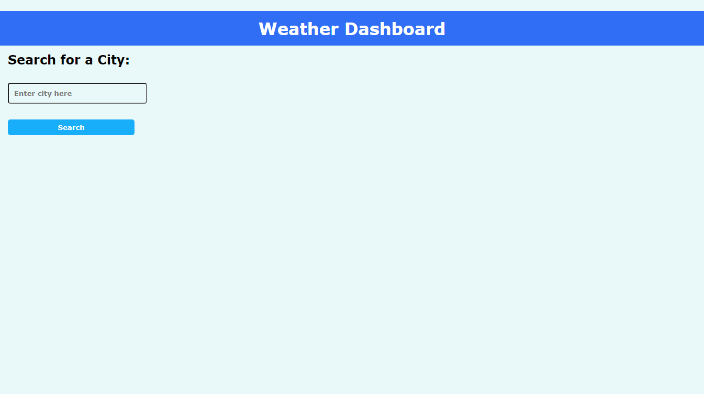

## Weather-Dashboard

## Objective:

Create a weather outlook for multiple cities using the OpenWeather One Call API.

## Details:

* A search box to type in city. User 'clicks'
button and then the current and future conditions are displayed. 

* The city name, date, weather icon, temperature, humidity, wind speed and uv index are available.

* Future five-day forecast weather conditions also appear.

* The search history of previous cities visited are is saved. 

------

https://openweathermap.org/api/one-call-api